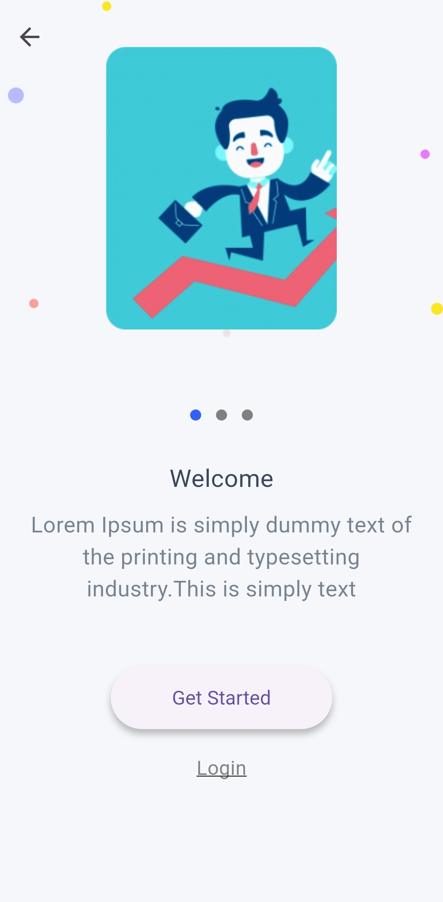
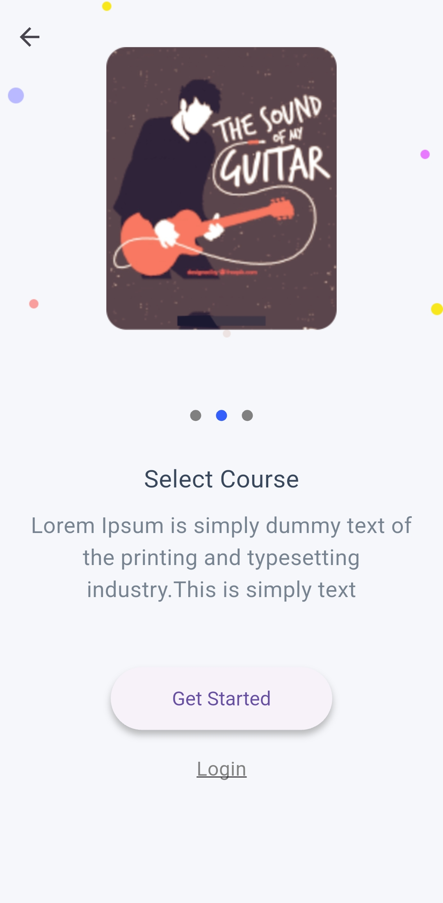
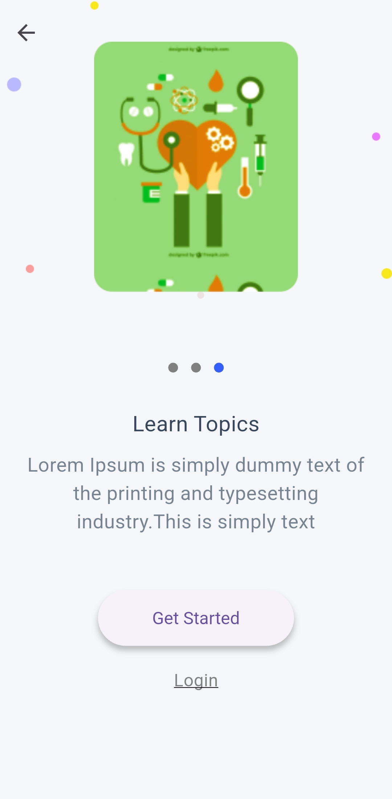
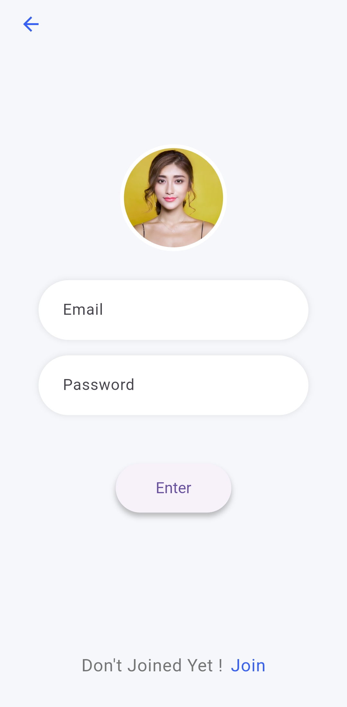
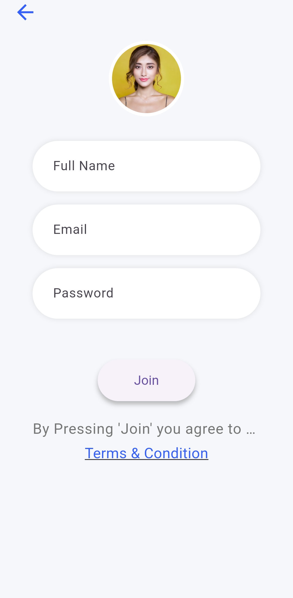
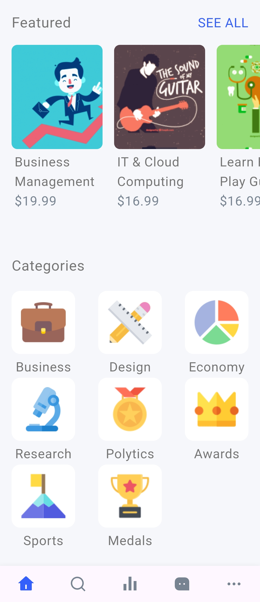
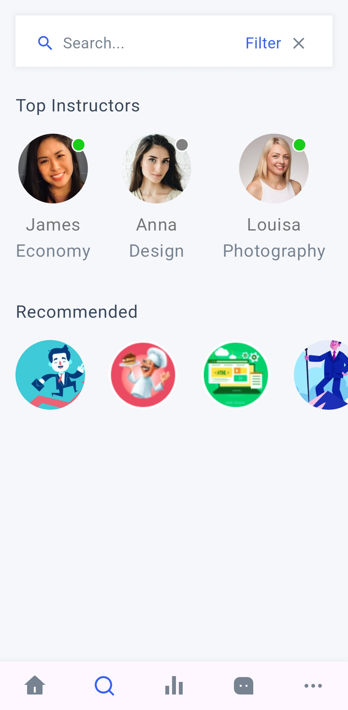
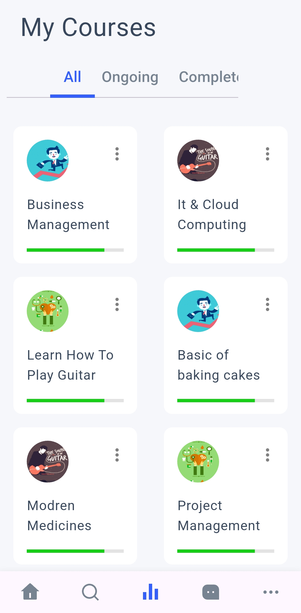
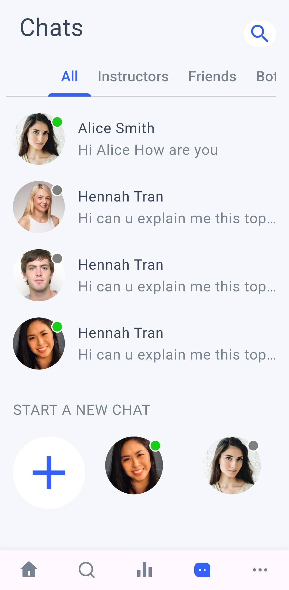
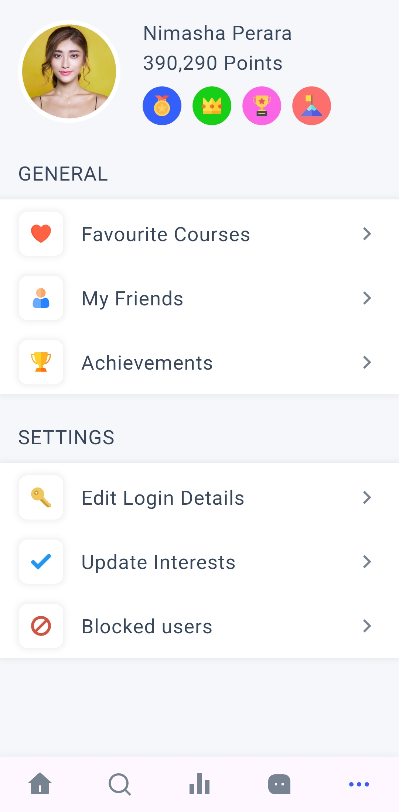

# Learner Flutter – UI Demo

A Flutter demo app designed with a clean, educational-style interface.  
This is a **UI-only** project with no backend or dynamic functionality.

---

## 📱 Overview

The app features screens suitable for:

- Learning platforms
- Course browsing
- Content previews
- Profile & onboarding screens

---

## 🔍 Status

**Demo only** – UI focused, no backend logic implemented.

---

## 📸 Screenshots

<table>
  <tr>
    <td></td>
    <td></td>
    <td></td>
    <td></td>
  </tr>
  <tr>
    <td></td>
    <td></td>
    <td></td>
    <td></td>
  </tr>
  <tr>
    <td></td>
    <td></td>
    <td></td>
    <td></td>
  </tr>
</table>

---

## 📝 Notes

- Built entirely with Flutter
- Modular and reusable UI components
- Great starting point for learning or course-based apps

---

## ✍️ Created by

**Mohamed Ebrahim**
